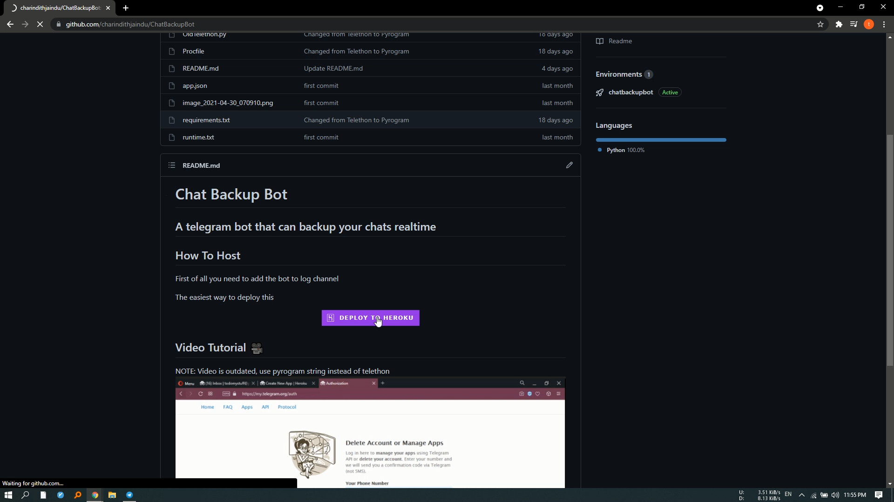

# Chat Backup Bot
## A telegram bot that can backup your chats realtime

## How To Host

First of all you need to add the bot to log channel

The easiest way to deploy this

## Video Tutorial 🎥
NOTE: Video is outdated, use pyrogram string instead of telethon
  
